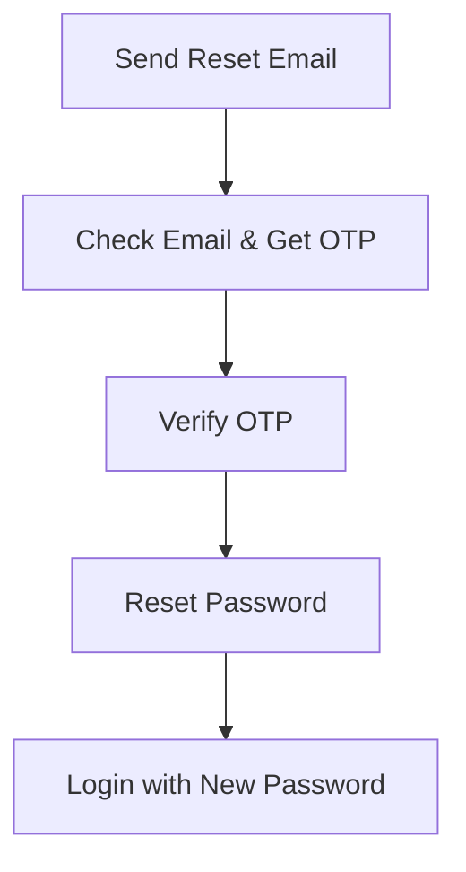
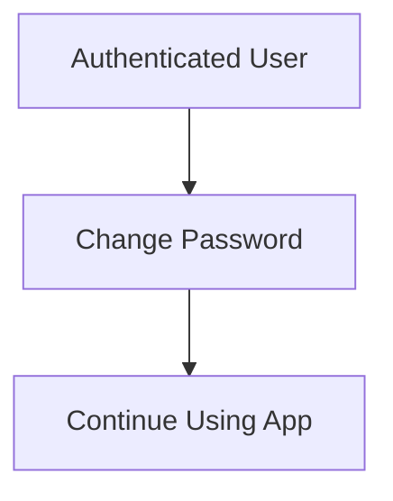

# 🏃‍♂️ Playmate - Sports Social Platform API


A comprehensive sports social platform API built with Node.js, Express.js, and MySQL. Features user authentication with image uploads, email notifications, sports management, and skill tracking. Perfect for building sports community applications.

## 📋 Table of Contents

- [Features](#features)
- [Quick Start](#quick-start)
- [API Documentation](#api-documentation)
- [Database Schema](#database-schema)
- [Environment Setup](#environment-setup)
- [Contact](#contact)

## ✨ Features

- 🔐 **JWT Authentication** - Secure token-based authentication system
- 👤 **User Management** - Complete user registration and login
- 📷 **Image Upload** - Profile pictures with Cloudinary CDN integration
- 📧 **Email Services** - Welcome emails and notifications with Nodemailer
- ✅ **Input Validation** - Comprehensive validation using express-validator
- 🏆 **Sports System** - Multi-sport support with skill level tracking
- 🗄️ **MySQL Integration** - Robust database with connection pooling & transactions
- 🛡️ **Security Features** - Password hashing, CORS, SQL injection prevention
- 📊 **Health Monitoring** - API health checks with system metrics
- 🔍 **Email Availability** - Real-time email checking before registration
- 📱 **RESTful API** - Clean, standardized API responses
- 🌟 **Default Assets** - Automatic default profile images
- 🌥️ **Cloud Storage** - Automatic image optimization and CDN delivery

## 🚀 Quick Start

### Prerequisites
- Node.js 16+
- MySQL 8.0+
- npm/yarn

### Installation

```bash
# Clone repository
git clone <repository-url>
cd playmate

# Install dependencies
npm install

# Set up environment
cp .env.example .env

# Start server
npm start
```

**Base URL:** `http://localhost:3000/api/v1/auth`

## 📖 API Documentation

### Endpoints

| Endpoint | Method | Description | Auth Required |
|----------|---------|-------------|---------------|
| `/register` | POST | Register new user | ❌ |
| `/login` | POST | User login | ❌ |
| `/check-email` | POST | Check email availability | ❌ |
| `/reset-password-email` | POST | Send password reset OTP | ❌ |
| `/verify-otp` | POST | Verify password reset OTP | ❌ |
| `/reset-password` | POST | Reset password with new password | ❌ |
| `/change-password` | POST | Change password (authenticated) | ✅ |
| `/health` | GET | API health check | ❌ |

### Standard Response Format

**Success Response**:
```json
{
    "status": true,
    "statusCode": 200,
    "message": "Success message",
    "data": {},
    "token": "jwt_token",
    "timestamp": "2025-12-04T10:30:00.000Z"
}
```

**Error Response**:
```json
{
    "status": false,
    "statusCode": 400,
    "message": "Validation failed",
    "errors": [
        {
            "field": "user_email",
            "message": "Please provide a valid email address"
        }
    ],
    "timestamp": "2025-12-04T10:30:00.000Z"
}
```

### User Registration

**POST** `/api/v1/auth/register`

**Content-Type**: `multipart/form-data`

**Form Fields**:
```
user_email: john.doe@example.com
user_password: SecurePass123!
first_name: John
last_name: Doe
profile_image: [FILE] (optional - image file)
```

**cURL Example**:
```bash
curl -X POST http://localhost:4000/api/v1/auth/register \
  -F "user_email=john.doe@example.com" \
  -F "user_password=SecurePass123!" \
  -F "first_name=John" \
  -F "last_name=Doe" \
  -F "profile_image=@/path/to/your/image.jpg"
```

**Image Upload Details**:
- **Accepted formats**: JPG, PNG, GIF, WebP
- **File size limit**: 10MB
- **Processing**: Automatically uploaded to Cloudinary CDN
- **Default avatar**: Provided if no image uploaded
- **Storage**: Cloudinary secure URLs saved in database

**Success Response (201)**:
```json
{
    "status": true,
    "statusCode": 201,
    "message": "User registered successfully",
    "data": {
        "user_id": 1,
        "user_email": "john.doe@example.com",
        "first_name": "John",
        "last_name": "Doe",
        "profile_image": "https://res.cloudinary.com/your-cloud/image/upload/v1234567890/user_profiles/abc123.jpg"
    },
    "token": "eyJhbGciOiJIUzI1NiIsInR5cCI6IkpXVCJ9...",
    "timestamp": "2025-12-05T10:30:00.000Z"
}
```

### User Login

**POST** `/api/v1/auth/login`

**Request Body**:
```json
{
    "user_email": "john.doe@example.com",
    "user_password": "SecurePass123!"
}
```

**Success Response (200)**:
```json
{
    "status": true,
    "statusCode": 200,
    "message": "Login successful",
    "data": {
        "user_id": 1,
        "user_email": "john.doe@example.com",
        "first_name": "John",
        "last_name": "Doe",
        "profile_image": "https://res.cloudinary.com/your-cloud/image/upload/v1234567890/user_profiles/abc123.jpg"
    },
    "token": "eyJhbGciOiJIUzI1NiIsInR5cCI6IkpXVCJ9...",
    "timestamp": "2025-12-05T10:30:00.000Z"
}
```

### Check Email Availability

**POST** `/api/v1/auth/check-email`

**Request Body**:
```json
{
    "user_email": "test@example.com"
}
```

**Success Response (200)**:
```json
{
    "status": true,
    "statusCode": 200,
    "message": "Email availability checked",
    "data": {
        "available": true,
        "user_email": "test@example.com",
        "message": "Email is available"
    },
    "timestamp": "2025-12-05T10:30:00.000Z"
}
```

### Health Check

**GET** `/api/v1/auth/health`

**Success Response (200)**:
```json
{
    "status": true,
    "statusCode": 200,
    "message": "Auth API is healthy",
    "data": {
        "service": "auth",
        "version": "1.0.0",
        "environment": "development",
        "uptime": "127.45 seconds",
        "responseTime": "3ms",
        "database": "up",
        "system": {
            "memory": {
                "rss": 45678912,
                "heapUsed": 23456789,
                "heapTotal": 34567890
            },
            "cpu": {
                "load1m": 0.5,
                "load5m": 0.3,
                "load15m": 0.2
            }
        }
    },
    "timestamp": "2025-12-05T10:30:00.000Z"
}
```

## 🔐 Password Management APIs

### Send Password Reset Email

**POST** `/api/v1/auth/reset-password-email`

**Request Body**:
```json
{
    "user_email": "user@example.com"
}
```

**Success Response (200)**:
```json
{
    "status": true,
    "statusCode": 200,
    "message": "Password reset OTP sent",
    "data": {
        "resetOtpSent": true
    },
    "timestamp": "2025-12-07T14:35:27.120Z"
}
```

**Process**: Generates 4-digit OTP → Sends email with beautiful template → Stores OTP in secure cookie (5 min expiry)

### Verify OTP

**POST** `/api/v1/auth/verify-otp`

**Request Body**:
```json
{
    "otp": "1234"
}
```

**Success Response (200)**:
```json
{
    "status": true,
    "statusCode": 200,
    "message": "OTP verified successfully",
    "data": null,
    "timestamp": "2025-12-07T14:35:27.120Z"
}
```

**Process**: Validates OTP against cookie → Clears cookie on success → Enables password reset

### Reset Password

**POST** `/api/v1/auth/reset-password`

**Request Body**:
```json
{
    "user_email": "user@example.com",
    "new_password": "NewPassword123!"
}
```

**Success Response (200)**:
```json
{
    "status": true,
    "statusCode": 200,
    "message": "Password has been reset successfully",
    "data": null,
    "timestamp": "2025-12-07T14:35:27.120Z"
}
```

**Process**: Validates new password → Hashes with bcrypt → Updates database

### Change Password (Protected)

**POST** `/api/v1/auth/change-password`

**Headers**:
```
Authorization: Bearer <jwt-token>
Content-Type: application/json
```

**Request Body**:
```json
{
    "currentPassword": "OldPassword123!",
    "newPassword": "NewPassword123!"
}
```

**Success Response (200)**:
```json
{
    "status": true,
    "statusCode": 200,
    "message": "Password changed successfully",
    "data": null,
    "timestamp": "2025-12-07T14:35:27.120Z"
}
```

**Process**: Extracts user from JWT → Validates current password → Hashes new password → Updates database

### Password Security Requirements

All password fields must meet these criteria:
- **Length**: 8-60 characters
- **Lowercase**: At least one letter (a-z)
- **Uppercase**: At least one letter (A-Z)  
- **Number**: At least one digit (0-9)
- **Special**: At least one symbol (@$!%*?&)

### OTP Email Template

Users receive a beautiful HTML email with:
- 🔐 **Professional Design**: Green theme with Playmate branding
- **4-Digit OTP**: Large, clearly displayed verification code
- **Security Warning**: Instructions not to share the OTP
- **Expiry Notice**: 10-minute validity period
- **Auto-Generated**: No-reply email address

## 🗄️ Database Schema

### Users Table
```sql
CREATE TABLE users (
    user_id INT AUTO_INCREMENT PRIMARY KEY,
    user_email VARCHAR(100) NOT NULL UNIQUE,
    user_password VARCHAR(61) NOT NULL,
    first_name VARCHAR(50) NOT NULL,
    last_name VARCHAR(50) NULL,
    profile_image VARCHAR(165) NULL,
    created_at TIMESTAMP DEFAULT CURRENT_TIMESTAMP,
    updated_at TIMESTAMP NULL ON UPDATE CURRENT_TIMESTAMP,
    INDEX idx_user_email (user_email)
);
```

### Sports Table
```sql
CREATE TABLE sports (
    sport_id INT AUTO_INCREMENT PRIMARY KEY,
    sport_name VARCHAR(100) NOT NULL UNIQUE,
    created_at TIMESTAMP DEFAULT CURRENT_TIMESTAMP,
    INDEX idx_sport_name (sport_name)
);
```

### User Sports (Many-to-Many Relationship)
```sql
CREATE TABLE user_sports (
    user_sport_id INT AUTO_INCREMENT PRIMARY KEY,
    user_id INT NOT NULL,
    sport_id INT NOT NULL,
    skill_level ENUM('Beginner', 'Intermediate', 'Pro') NULL,
    created_at TIMESTAMP DEFAULT CURRENT_TIMESTAMP,
    FOREIGN KEY (user_id) REFERENCES users(user_id) ON DELETE CASCADE,
    FOREIGN KEY (sport_id) REFERENCES sports(sport_id) ON DELETE CASCADE,
    UNIQUE KEY unique_user_sport (user_id, sport_id),
    INDEX idx_user_id (user_id),
    INDEX idx_sport_id (sport_id)
);
```

### Default Sports Data
The system automatically inserts these default sports:
- Cricket
- Pickleball

## ⚙️ Environment Setup

Create `.env` file:

```env
# Server Configuration
PORT=4000

# Database Configuration
DB_HOST=localhost
DB_PORT=3306
DB_USER=your_mysql_username
DB_PASSWORD=your_mysql_password
DB_NAME=playmate_db

# JWT Configuration
JWT_SECRET=your_super_secret_jwt_key
JWT_EXPIRES_IN=7d

# Cloudinary Configuration
CLOUDINARY_CLOUD_NAME=your_cloud_name
CLOUDINARY_API_KEY=your_api_key
CLOUDINARY_SECRET_KEY=your_secret_key

# Email Configuration
EMAIL=abc@gmail.com
EMAIL_PASSWORD=qwq qwe qwe
EMAIL_SERVICE=Gmail
```

### Image Upload Flow

1. **Frontend**: User selects image file in form
2. **Multer**: Receives and temporarily stores uploaded file
3. **Validation**: Checks file type and size limits
4. **Cloudinary**: Uploads image to cloud storage
5. **Database**: Stores Cloudinary URL in user profile
6. **Response**: Returns user data with image URL

### Default Profile Image

If no image is uploaded, users automatically receive:
```
https://res.cloudinary.com/dsw5tkkyr/image/upload/v1764845539/avatar_wcaknk.png
```

### 📧 Email System

**Welcome Email**: Automatically sent upon successful registration using Nodemailer
- **Service**: Gmail SMTP
- **Template**: Custom HTML template with user's name
- **Subject**: "Welcome to Playmate!"
- **Content**: Personalized welcome message with platform introduction

**Email Configuration**:
```javascript
// Supports Gmail, Outlook, Yahoo, and custom SMTP
transporter: {
  service: 'Gmail',
  auth: {
    user: process.env.EMAIL,
    pass: process.env.EMAIL_PASSWORD  // App-specific password
  }
}
```

### 🔐 Password Requirements

- Minimum 8 characters
- At least one lowercase letter
- At least one uppercase letter
- At least one number
- At least one special character (@$!%*?&)

## 🔄 Password Management Workflows

### Forgot Password Flow (3 Steps)

For users who don't remember their current password:



**Step 1**: `POST /reset-password-email` with email
**Step 2**: `POST /verify-otp` with 4-digit OTP from email  
**Step 3**: `POST /reset-password` with email + new password

### Change Password Flow (1 Step)

For authenticated users who know their current password:



**Step 1**: `POST /change-password` with current + new password + JWT token

### Security Features

- **🍪 Cookie-based OTP**: HTTP-only cookies prevent XSS attacks
- **⏰ Time Expiry**: 5-minute OTP validity window
- **🔒 JWT Protection**: Change password requires authentication
- **🧂 Salt Hashing**: bcrypt with dynamic salt generation
- **📧 Email Verification**: OTP sent to verified email address
- **🚫 Rate Limiting**: Prevents brute force attacks
- **✅ Input Validation**: Comprehensive server-side validation

### 📁 Project Structure

```
playmate/
├── app.js                    # Main Express application class
├── package.json              # Project dependencies & scripts
├── .env                      # Environment variables
├── .gitignore               # Git ignore rules
├── config/
│   └── db.js                # MySQL database connection pool
├── controllers/
│   └── authController.js    # Authentication business logic
├── middleware/
│   ├── authUser.js          # JWT token verification middleware
│   ├── multer.js            # File upload configuration
│   └── validation.js       # Express-validator rules
├── models/
│   ├── User.js              # User database model
│   ├── Sport.js             # Sports reference model
│   └── UserSport.js         # User-Sport relationship model
├── routes/
│   └── authRouter.js        # Authentication API routes
└── utils/
    ├── AuthHelpers.js       # Password & JWT utilities
    ├── Cloudinary.js        # Cloud storage configuration
    ├── Mail.js              # Email service utilities
    ├── emailTemplates.js    # HTML email templates
    └── Response.js          # Standardized API responses
```

### 📦 Core Dependencies

```json
{
  "express": "^5.2.1",          // Web framework
  "mysql2": "^3.15.3",          // MySQL database driver
  "bcrypt": "^6.0.0",           // Password hashing
  "jsonwebtoken": "^9.0.3",     // JWT authentication
  "express-validator": "^7.3.1", // Input validation & sanitization
  "multer": "^2.0.2",           // Multipart file upload handling
  "cloudinary": "^2.8.0",      // Cloud image storage & CDN
  "nodemailer": "^7.0.11",     // Email service integration
  "cors": "^2.8.5",            // Cross-origin resource sharing
  "dotenv": "^17.2.3"          // Environment variable management
}
```

### 🚀 Quick Start Commands

```bash
# Clone repository
git clone https://github.com/Mitan11/playmate.git

# Install dependencies
npm install

# Set up environment variables
cp .env.example .env
# Edit .env with your configuration

# Create MySQL database
mysql -u root -p
CREATE DATABASE playmate_db;

# Start development server
node app.js
```

## 🔄 Future Enhancements

- 🏀 **Sport Management API** - Full CRUD operations for sports
- 👥 **Friend System** - User connections and friend requests  
- 🏟️ **Venue Management** - Sports venue booking system
- 📅 **Event Scheduling** - Create and join sports events
- 💬 **Chat System** - Real-time messaging between users
- 🏆 **Achievement System** - Badges and rewards for activities
- 📊 **Analytics Dashboard** - User activity and sports statistics
- 🔔 **Push Notifications** - Event reminders and updates

## 🚀 Production Deployment

### Environment Variables
Ensure all required environment variables are configured:
- Database credentials for production MySQL instance
- Cloudinary account for image storage
- Gmail app-specific password for email services
- Strong JWT secret key (min. 32 characters)

### Security Considerations
- Use HTTPS in production
- Implement rate limiting
- Add request logging
- Configure proper CORS origins
- Use environment-specific configurations

### Recommended Infrastructure
- **Database**: MySQL 8.0+ with connection pooling
- **File Storage**: Cloudinary or AWS S3
- **Hosting**: Railway, Render, or AWS EC2
- **CDN**: Cloudinary automatic optimization

## 📞 Contact

[](mailto:mitantank00@gmail.com)
[](https://www.linkedin.com/in/mitan-tank-986076247)
[](https://www.instagram.com/__.mituu._)

---

**Built with ❤️ by [Mitan Tank](https://github.com/Mitan11)**
